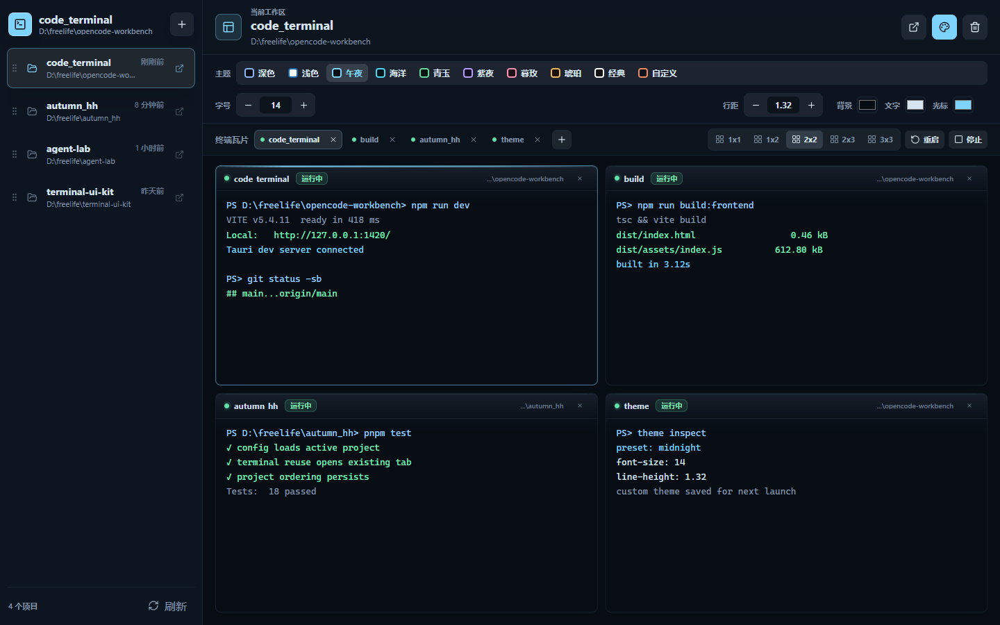

# Code Terminal

一个面向多项目开发的桌面终端工作台。它把常用项目、多个本地终端、瓦片布局和外观配置放在一个轻量窗口里，适合同时维护多个代码仓库、频繁切换命令行上下文的开发者。

> Built with Tauri, React, TypeScript, Rust and xterm.js.

## 界面预览



## 适合谁

- 经常在多个项目之间来回切换，需要快速打开不同项目终端的人
- 希望一个窗口里同时看多个命令、日志、构建任务的人
- 想要比系统终端更贴近项目工作流，但又不想引入笨重 IDE 面板的人
- Windows 用户，尤其是习惯直接打开本地 exe 管理多个项目的人

## 亮点

- **项目列表**：保存常用项目目录，支持拖动排序，默认优先打开排在前面的项目。
- **项目复用**：点击项目时，如果对应终端页已经存在，会直接切回现有页面，避免重复打开。
- **多终端瓦片**：支持 `1x1`、`1x2`、`2x2`、`2x3`、`3x3` 等布局，并可关闭多余终端后自动按剩余终端重新分配。
- **真实本地 PTY**：后端创建本地伪终端，支持交互式命令、ANSI 颜色、resize 和常规 shell 工作流。
- **项目窗口标题**：窗口标题和左上角显示当前项目文件夹名，任务栏里更容易区分多个项目窗口。
- **外观可调**：内置多套主题，也支持编辑并保存自定义主题；字号和行间距都可以直接输入。
- **图片粘贴桥接**：在界面中粘贴图片后，应用会临时保存图片，让 TUI 或命令行程序读取对应文件路径。
- **多项目入口**：可以从当前应用里打开另一个项目窗口，不用反复手动点 exe。

## 快速开始

```powershell
npm install
npm run dev
```

## 构建 Windows exe

```powershell
npm run build
```

构建完成后，可执行文件位于：

```text
src-tauri/target/release/code-terminal.exe
```

如果需要生成安装包：

```powershell
npm run bundle
```

Windows MSI 打包会下载 WiX 工具链，网络较慢时可能需要重试。

## 技术栈

- **Desktop**：Tauri 2
- **Frontend**：React 18、TypeScript、Vite
- **Terminal UI**：xterm.js
- **Backend**：Rust、portable-pty
- **Platform focus**：Windows 优先，同时保留 macOS/Linux shell 启动逻辑

## 本地终端行为

- Windows 默认启动 `powershell.exe -NoLogo`
- macOS/Linux 默认使用 `$SHELL`，没有 `$SHELL` 时使用 `/bin/sh`
- 选中项目后，终端工作目录就是该项目目录
- 关闭应用时，会清理由工作台创建的终端进程

## 还在继续做

- 更完善的发布包和 GitHub Release
- 更多终端主题预设
- 更细的项目分组和启动配置
- 更稳定的跨平台行为验证

## License

当前暂未添加开源许可证；使用或二次开发前，请先联系作者确认授权方式。
